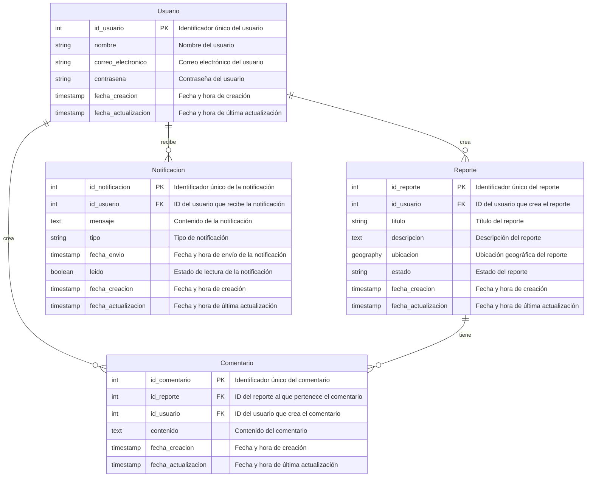

# Mapa de Seguridad Urbana - Diego Fernando Orozco (DFO)
> Modelo - ChatGPT

## Índice

1. [Descripción general del producto](prompts-descripcion.md#1-descripción-general-del-producto)
2. [Arquitectura del sistema](prompts-arquitectura.md#2-arquitectura-del-sistema)
3. [Modelo de datos](prompts-modelo-datos.md#3-modelo-de-datos)
4. [Especificación de la API](prompts-especificacioapi.md#4-especificación-de-la-api)
5. [Historias de usuario](prompts-hu.md#5-historias-de-usuario)
6. [Tickets de trabajo](prompts-tickets.md#6-tickets-de-trabajo)
7. [Pull requests](#7-pull-requests)

---

### 3. Modelo de Datos

> Modelo - ChatGPT

**Prompt 1:**

Ahora actúa como un experto en arquitectura de software y dba en postgres.
Crea el modelo de datos para cada microservicio, dónde:
1. La base de datos se llamará vigilcity
2. Cada microservicio tendrá un esquema en la base de datos postgress.
3. Puede haber un esquema principal o transversal si es necesario, esto para no duplicar entidades con la misma información en diferentes esquemas.
4. Define las llaves primarias y foráneas
5. Genera para las entidades transaccionales una columna de fecha y hora de creación del registro y otra de fecha y hora de actualización del registro.
6. Utiliza buenas prácticas para la creación del modelo de datos, buenas prácticas de nombramiento de campos, entidades, llaves, índices, etc.
7. Las entidades finales deben estar normalizadas en la tercera forma normal
8. Genera el modelo en mermaid

**Prompt 2:**

Para cada entidad, genera la especificación en forma de tabla incluyendo incluir el máximo detalle, como el nombre y tipo de cada atributo, descripción breve si procede, claves primarias y foráneas, relaciones y tipo de relación, restricciones (unique, not null…), etc.

**Prompt 3:**

Ahora ajusta este modelo de datos inicial realizando los siguientes ajustes:
1. En la entidad [Reporte] eliminar titulo, ubicacion, estado y fecha_actualizacion.
2. En la entidad [Reporte] agregar direccion, latitud, longitud.
3. En la entidad [Reporte] agregar la categoría del reporte, estas son las categorías: Iluminación, Robo, Vandalismo, Drogadicción, Vías en mal estado, Asalto en trasnporte público, Esquina peligrosa.
4. En la entidad [Comentario] eliminar el campo fecha_actualizacion.
5. Los comentarios deb poderse ranquear con una escala de 1 a 5 y conservar los puntajes que se le han dado a cada comentario.
6. Para el MVP la entidad [Notificacion] ya no es necesaria.

El modelo es el siguiente:

**Prompt 4:**

el comentario tiene mal, ya que la puntuación es única y sería reemplazada por el último valor que se ingrese, se necesita que el puntaje se almacene en otra tabla llamada rating que lleve el puntaje que se le ha dado a cada comentario y el campo puntaje de la entidad comentario será calculado con sus puntajes promedio